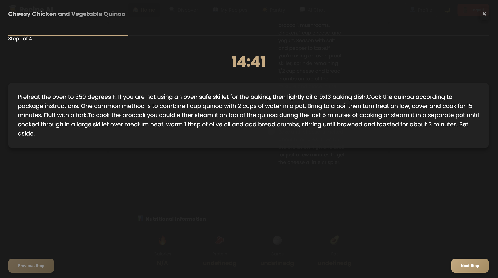

# 👨‍🍳 Recipe AI

<div align="center">
  <h1>👨‍🍳 Recipe AI</h1>
  <p><em>Your Intelligent Kitchen Assistant</em></p>
</div>

<div align="center">
  
</div>

## 🌟 Overview

Recipe AI is a modern web application that transforms your available ingredients into delicious recipes using artificial intelligence. With an intuitive interface and powerful features, it makes cooking both fun and efficient.


## ✨ Key Features

### 🤖 AI-Powered Recipe Generation
<div align="center">
  
</div>

- Personalized recipe suggestions based on your ingredients
- Smart adaptation to dietary preferences
- Nutritional information calculation
- Step-by-step cooking instructions

### 🧪 Smart Pantry Management
<div align="center">
  
</div>

- Inventory tracking with expiration dates
- Low stock alerts
- Categorized ingredient organization
- Quick ingredient selection for recipes

### 👩‍🍳 Interactive Cooking Mode
<div align="center">
  
</div>

- Step-by-step guidance
- Built-in timers
- Ingredient checklist
- Progress tracking

### 🎨 Modern UI/UX
<div align="center">
  
</div>

- Responsive design for all devices
- Dark/Light mode
- Intuitive navigation
- Smooth animations

## 🚀 Getting Started

### Prerequisites
- Node.js (v18.0.0 or higher)
- MongoDB
- Google Gemini API key

### Installation

1. **Clone the repository**
```bash
git clone https://github.com/yourusername/recipe-ai
cd recipe-ai
```

2. **Install dependencies**
```bash
# Install server dependencies
cd server
npm install

# Install client dependencies
cd ../client
npm install
```

3. **Environment Setup**
```bash
# Server configuration (.env)
PORT=5002
GEMINI_API_KEY=your_gemini_api_key
MONGODB_URI=mongodb://localhost:27017/recipe-app
JWT_SECRET=your_secure_jwt_secret
```

### Running the Application

1. **Start the server**
```bash
cd server
npm run dev
```

2. **Start the client**
```bash
cd client
npm start
```

Access the application at:
- Frontend: `http://localhost:3000`
- Backend: `http://localhost:5002`

## 📱 Features Showcase

### User Authentication
<div align="center">
  
</div>

### Recipe Generation
<div align="center">
  
</div>

### Smart Pantry
<div align="center">
  
</div>

## 🛠️ Technology Stack

### Frontend
- React.js
- Context API for state management
- CSS with CSS Variables
- Responsive Design

### Backend
- Node.js with Express
- MongoDB with Mongoose
- JWT Authentication
- Google Gemini AI Integration

## 📦 Project Structure

```
recipe-ai/
├── client/                 # Frontend React application
├── server/                 # Backend Node.js server
├── docs/                   # Documentation and images
└── README.md              # Project documentation
```

## 🤝 Contributing

1. Fork the repository
2. Create your feature branch (`git checkout -b feature/AmazingFeature`)
3. Commit your changes (`git commit -m 'Add some AmazingFeature'`)
4. Push to the branch (`git push origin feature/AmazingFeature`)
5. Open a Pull Request

## 📝 License

This project is licensed under the MIT License - see the [LICENSE](LICENSE) file for details.

## 🙏 Acknowledgments

- Google Gemini AI for recipe generation
- MongoDB for database services
<<<<<<< HEAD
- React.js community for frontend tools and libraries

## 📞 Support

For support, email nirajpandye283@gmail.com or open an issue in the repository.

## 🔄 Version History

- 1.0.0
  - Initial Release
  - Basic recipe generation
  - User authentication
  - Diet preference management


=======
- React.js community
- All contributors and supporters

---
<div align="center">
  
  <p>Made with ❤️ by [Your Name]</p>
</div>
>>>>>>> c65fe85 (Enhanced UI/UX and added new features:)
